# Getting started
## Cloning the repository
* Clone the repository to your laptop with GitHub Classroom

## Make a Unity 2D project
* Open Unity Hub
* New Project > Click on 2D (Build-in Render Pipeline) Core > Name the project > Choose the GitHub Repo Folder

## Install TextMeshPro
* Go to Window > Package manager

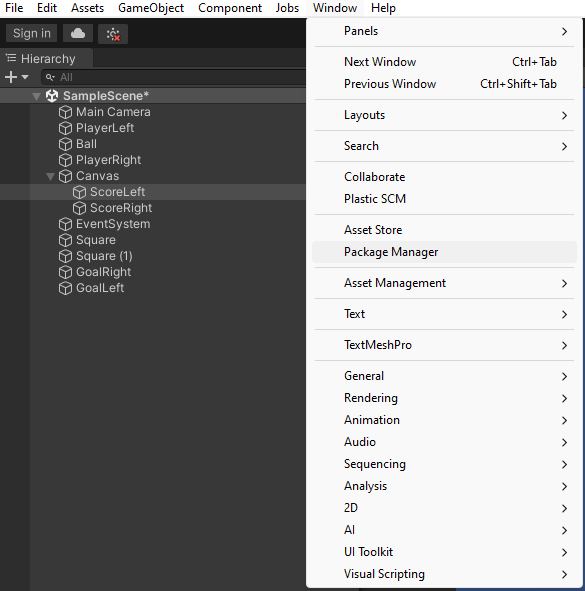

* Here, click on Packages: In project and change it to Unity Registry.
* Then search for TextMeshPro and install it.

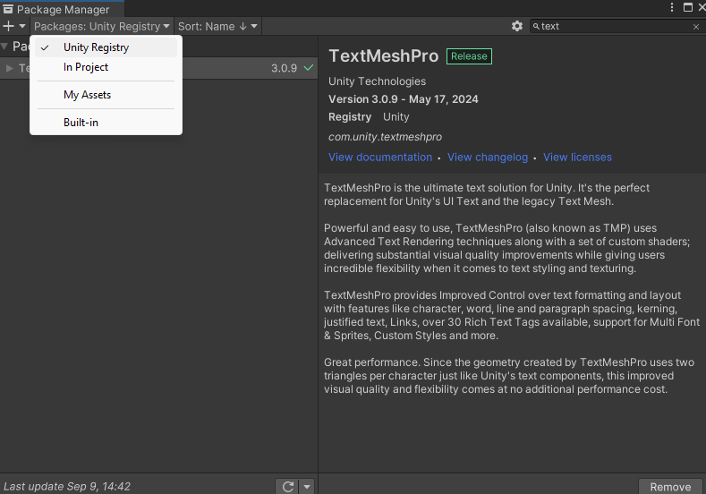

## Set Game display to Full HD
* Set the display to Full HD to make sure you can follow the rest of the steps.

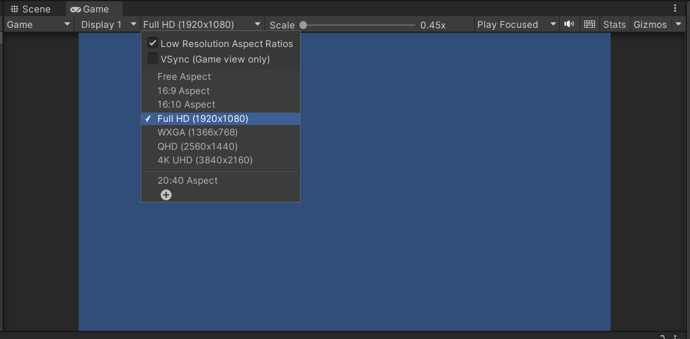

## Create and alter the GameObjects you need
* Via the following ways, add one circle sprite and two square sprites.

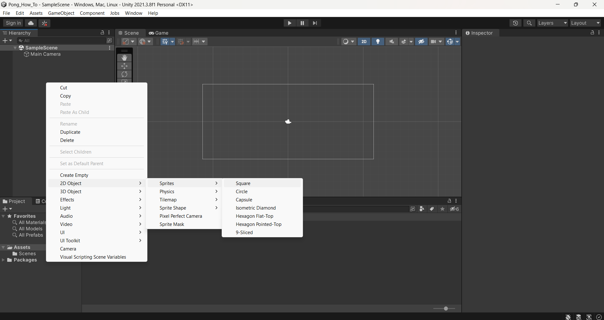
* Give one square sprite the following Transform.

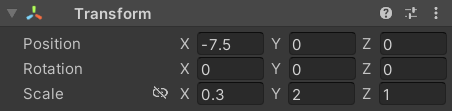
* Give the other square the same transform on the other side of the x-axis.
* Give the circle the size .5 by .5

You should have something like this:

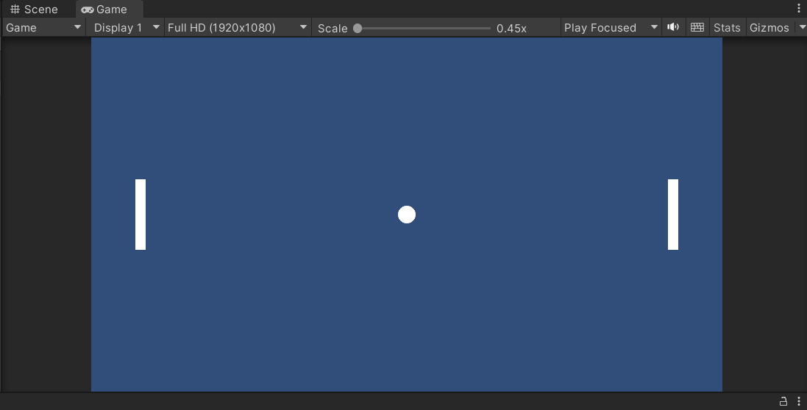

## Create Scoreboard
* Add text to the screen.

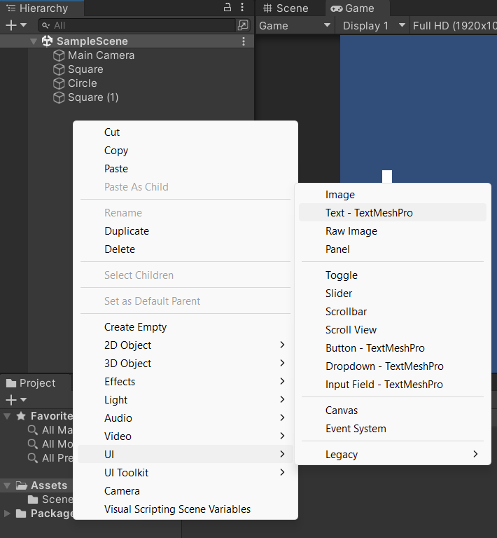

* Click on the Canvas and change the UI Scale Mode to "Scale with Screen Size".

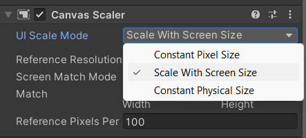

* Change some of the properties of your text element.

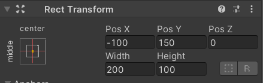
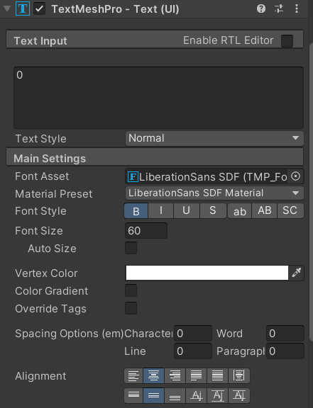

* Copy and paste the text object and change the x position to 100, so you have a score for each player.

## Rename elements
* Rename the elements as follows:

  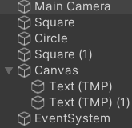
  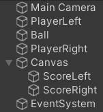

You're ready to code if everything looks like this

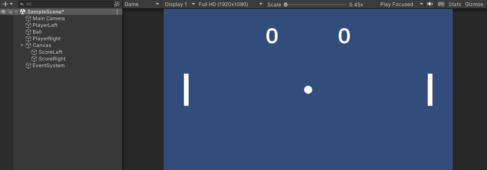
