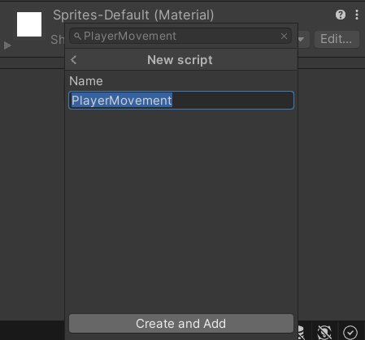
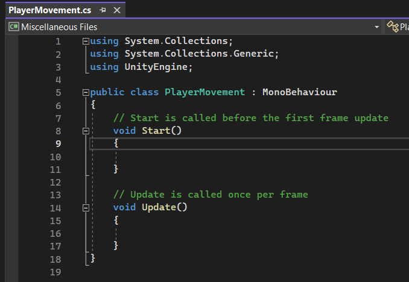
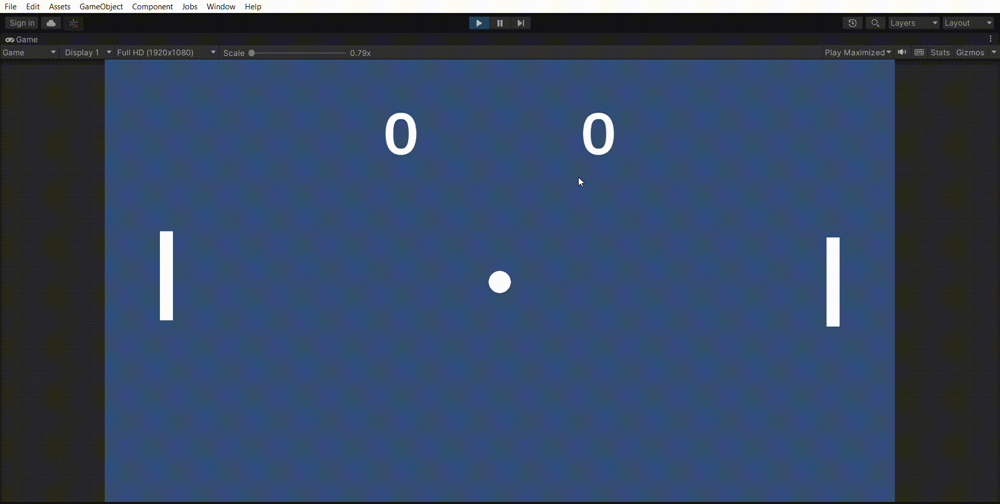

# Player movement

## Create new script
* Click on the object PlayerLeft.
* Click the button "Add Component"
* Type the following name in the searchbar: "PlayerMovement"
* Create and Add

## How is a script build up?

* A Unity C# script consists out of libraries (All the ones with "using" before it)
* A public class MonoBehaviour (We won't go in too deep about that one). Where you can put the code that will run.
* A void Start(){ }
* A void Update(){ }
* Your own functions, e.g. private void OwnFunction(){}, please create this function.
  
## See how they work
* Put "Debug.Log();" in the Start, Update and OwnFunction.
* In each one, put a different text, e.g. Debug.Log("start");
* Let the project run for a few seconds.
* See the effect of each function (Start, Update and OwnFunction), do you see each of your logs in the terminal?
* Call OwnFunction(); in the Update, run the project again for a few seconds.
* Delete all the logs in your script.

## Variables 
* Above the start (but within the brackets of the PlayerMovement) type the following: public int playerNumber = 1;
* Below that, type: private int pedalSpeed = 3;
* In the Unity Editor, make sure the other player also has the player movement script.

## Movement
* Make the players move by using transform.position.
  * https://docs.unity3d.com/ScriptReference/Transform-position.html
  * For the Vector3 added to the current position, you only need the y-value. So to the current position, add a vector3 where the y value is pedalSpeed * Time.deltaTime

## Keyboard to interaction
* Find out how you can use your keyboard as an input device, you can find the info here:
  * https://docs.unity3d.com/ScriptReference/Input.GetKey.html
  * https://docs.unity3d.com/ScriptReference/KeyCode.html
* You'll have two players, player, player 1 (left), and player 2 (right). Player 1 should move with the "W" and the "S" keys, player two with the up and down arrow. For now, just log when a player should move. So that's four logs: "Player 1 moves up", "Player 1 moves down", "Player 2 moves up", "Player 2 moves down".
* With some help, your game work as follows:

  
