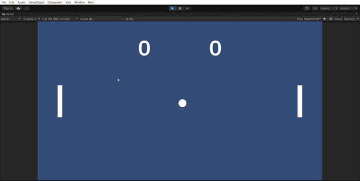

# Ball behaviour
First of all, you're going to get an explanation on vectors.

## A short recap on the theory in the explanation
* A vector is a line
* A Vector2D is a line in 2-dimensional space, a Vector3D is a line in 3-dimensional space
* RigidBody2D.velocity is a 2D vector, RigidBody3D.velocity is a 3D vector
* Vector2D.normalized and Vector3D.normalized means that the vector still has the same direction, but just the length of 1 unit.
 
## Starting direction and speed
* For the ball object, make a new script called BallMovement.
* Add Rigidbody2D to the ball object, set the Gravity Scale to 0.
* In the script, make the variable private int ballSpeed = 5;
* Also make the variable: private float direction;
* And the following: private Rigidbody2D rb;
* In the start function, type the following: rb = GetComponent<Rigidbody2D>();
* Also in the start function, give the ball speed. In order to do so, you'll need RigidBody2D.velocity and make it equal to ballSpeed * new Vector2 (1f,0f).
* Let Unity give you a random y value between -1 and 1 and put that in the start Vector2 (E.g. x=1, y=0.6 or x=1, y=-0.2). 
* Normalize the vector.

## Create collision
* Put a BoxCollider2D on the paddle objects and a CircleCollider2D on the ball. See how that influences your game.
* Around your playing field, create rectangles (just like you did with the paddles) and put a BoxCollider2D on it. 
* Make a new Physics Material 2D by creating new -> 2D -> Physics Material 2D.
* In that material, set the friction to 0 and the bounciness to 1.
* Attach the material to the rigidbody2D of the ball.
* Your game should now look like this:

