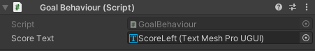
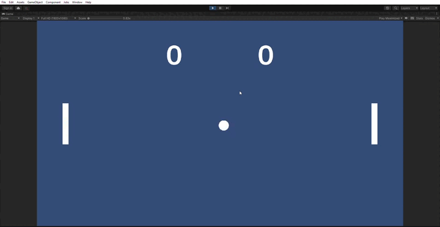
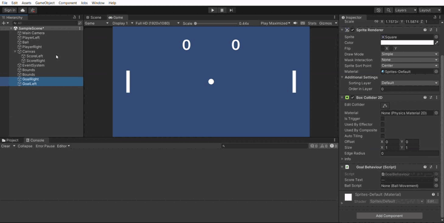
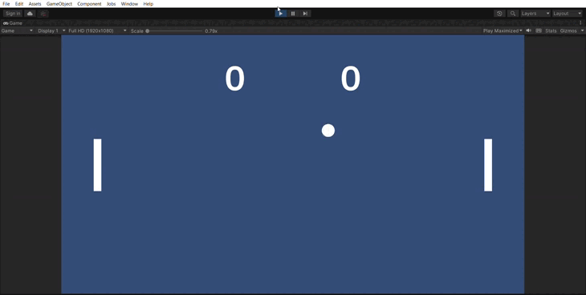

# Points and conditions
## Collision
* Create a new script called GoalBehaviour 
* In this script, register collision with [OnCollisionEnter2D](https://docs.unity3d.com/ScriptReference/MonoBehaviour.OnCollisionEnter2D.html)
* Inside the OnCollisionEnter2D function, put: Debug.Log("Collision entered");
* See if this triggers by starting the game and letting the ball touch the side of the screen.

## Variables
* On top of the file, write: using TMPro;
* Create different variables:
  * public int score = 0;
  * public TMP_Text scoreText;
* In the editor, connect the left goal to the right score text and vice versa. Do this by dragging the text component onto the score text area in the script:

## Update score and text
* Now, instead of logging "Collision Entered", I want the score to go up by 1, and then update the text to show the new score. Use the following:
  * scoreText.text
  * https://docs.unity3d.com/ScriptReference/Object.ToString.html
* Your game should look like this:

## Resetting the ball 
* Create a public void ResetBall(int spawnDirection)
* In this function, set the rb velocity the same as you do in the start, only now use spawnDirection for the x value.
* Also set the transform.position of the ball to 0,0,0 when it's reset.

* In the GoalBehaviour script, create a new variable: public BallMovement ballScript;
* In the editor, drag the ball object into the variable of the goal objects like this:

* In he GoalBehaviour script, add the following variable: public int goalSide;
* In the editor, make it so that GoalLeft goalSide has the value -1 and GoalRight goalSide has a value of 1
* Also in the GoalBehaviour script, after a goal is scored, put the following code:
  ballScript.ResetBall(goalSide);
* The game should now look like this:

