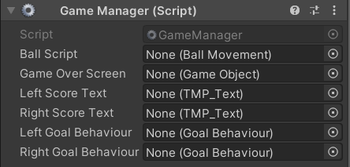
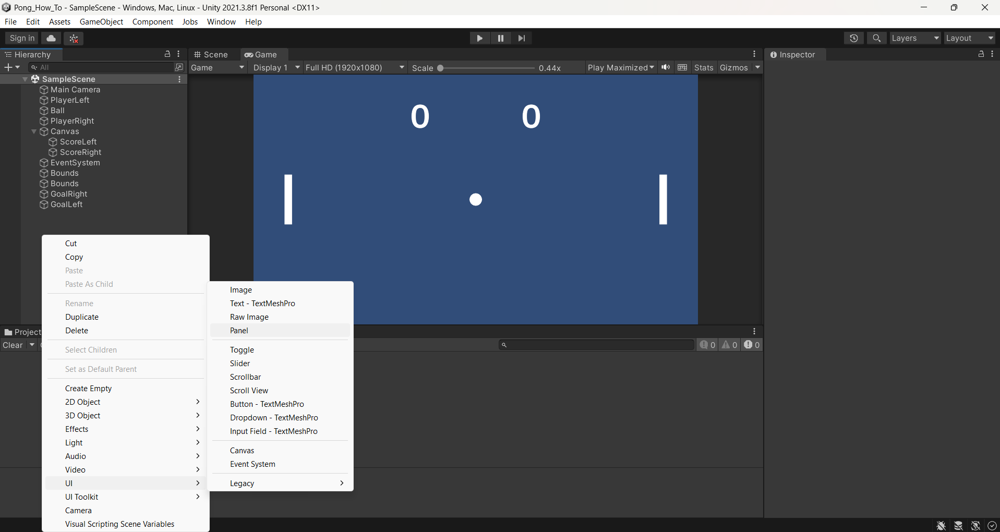
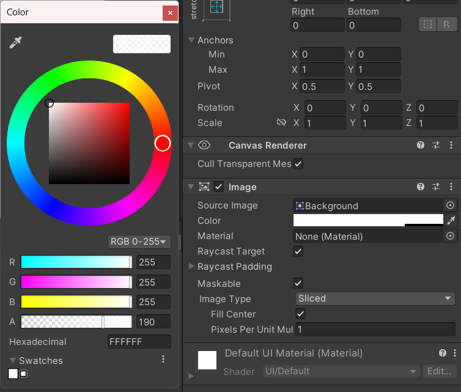
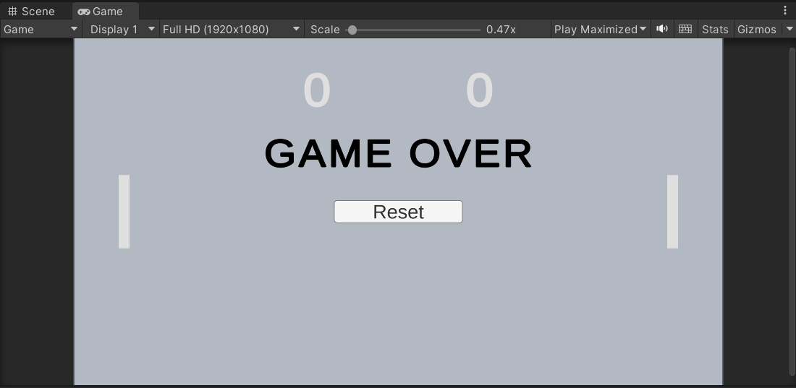
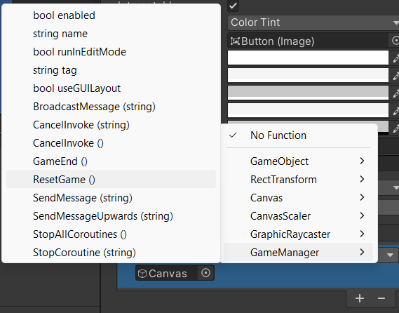
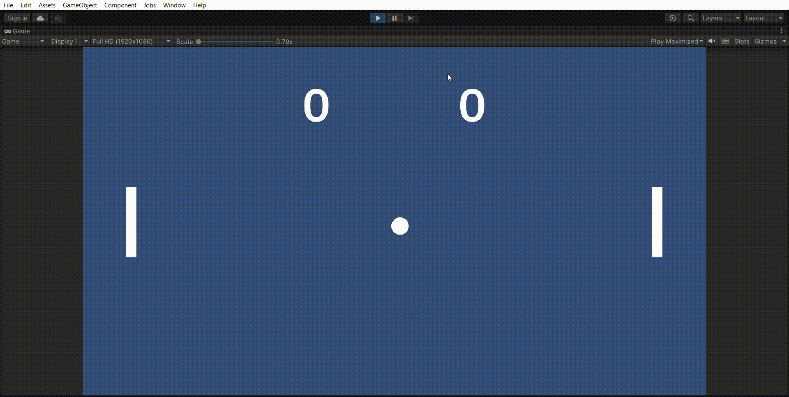

# Game over and Reset
## Game over sequence
* Add a new script to the canvas called GameManager
* In this script, create the following functions: 
  * public void GameEnd(){}
  * public void ResetGame(){}
* On top of the script, put: using TMPro;
* Also in this script, make the following variables:
  * public BallMovement ballScript;
  * public GameObject gameOverScreen;
  * public TMP_Text leftScoreText;
  * public TMP_Text rightScoreText;
  * public GoalBehaviour leftGoalBehaviour;
  * public GoalBehaviour rightGoalBehaviour;
* Connect the declared variables (except the gameOverScreen) to objects in the editor, just like you did in assignment 5_points_and_conditions

* In the GameEnd function, set the gameOverScreen object to active: [SetActive](https://docs.unity3d.com/ScriptReference/GameObject.SetActive.html)
* In the ResetGame function:
  * Set the gameOverScreen object to inactive.
  * Set left score and right score text to "0"
  * set leftGoalBehaviour.score to 0
  * call ballScript.ResetBall(-1)

* In the GoalBehaviour script, add the variable: public GameManager managementScript;
* In your OnCollisionEnter2D if the score is equal to 10, call gameManager.GameEnd();

## Game over conditions
* Create a new game object, a UI panel.

* Click on the panel, then click the Color, then change the A (Alpha) of the color to 200

* Add TMP text to the canvas. Change the text to "game over".
* Try some things inside the text component to make the text look good.
* Also add a button on the panel. Select the text object inside the button. Change the text of the button to Reset.

* In the button object, make a new On Click, connect the Canvas to it and then select the ResetGame() function.

* Connect the GameManager to the variable Management Script from GoalLeft and GoalRight in the editor 
* Connect the panel to the variable Game Over Screen from Canvas in the Editor.
* Your game should look and act like this:
